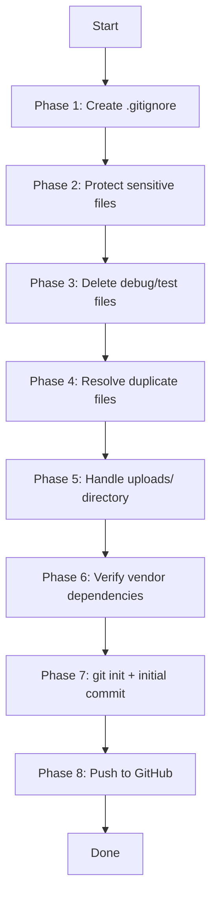

# Design Document

## Feature: clean-and-deploy

---

## Overview

This design covers the step-by-step process for cleaning the Boy Scout Management System project and publishing it safely to GitHub. The workflow is a one-time operational procedure executed by a developer in the project root. It produces a clean Git repository with no sensitive credentials, no debug/test files, no duplicate files, and a proper initial commit pushed to GitHub.

The output is a shell script (`clean-and-deploy.sh`) that automates the entire process, plus a set of supporting files (`.gitignore`, `config.example.php`, `.gitkeep` placeholders). The script is idempotent where possible — safe to re-run if interrupted.

---

## Architecture

The solution is a single Bash script that executes sequentially through eight phases, each corresponding to a requirement. The script performs file system operations and Git CLI commands. No application code is modified.



The script accepts one argument: the GitHub remote URL. All other decisions are hardcoded based on the confirmed requirements (e.g., `delete_event_new.php` is the active version, `edit_event.php` is the active version).

---

## Components and Interfaces

### clean-and-deploy.sh

The primary deliverable. Runs in the project root directory.

**Usage:**
```bash
bash clean-and-deploy.sh <github-remote-url>
```

**Phases:**
1. Create `.gitignore`
2. Create `config.example.php`
3. Delete debug/test files
4. Delete superseded duplicate files
5. Create `.gitkeep` files in `uploads/` subdirectories
6. Verify `composer.json` and `composer.lock` exist
7. `git init`, stage, safety-check, commit on `main`
8. Add remote, push

**Exit behavior:** The script exits with a non-zero code and a descriptive message on any failure.

### .gitignore

Created in the project root. Excludes:
- `config.php`, `database.php`
- `vendor/`
- `uploads/`
- `db/`
- `*.log`, `error.log`, `.env`
- `.DS_Store`, `Thumbs.db`
- `.vscode/`

### config.example.php

A safe reference file mirroring the structure of `config.php` with all credential values replaced by descriptive placeholders. Committed to the repository.

### .gitkeep files

Empty placeholder files placed in:
- `uploads/.gitkeep`
- `uploads/badge_icons/.gitkeep`
- `uploads/profile_pictures/.gitkeep`
- `uploads/proofs/.gitkeep`
- `uploads/waivers/.gitkeep`

---

## Data Models

This feature has no application data models. The relevant "data" is the file system state before and after the script runs.

**Pre-condition state:**
- No `.gitignore` exists
- No Git repository initialized
- Debug files present: `debug_event_update.php`, `test_brevo.php`, `test_event_update.php`, `test_modal.php`
- Duplicate files present: `delete_event.php`, `edit_event_simple.php`
- `uploads/` subdirectories exist but contain user data (not to be committed)
- `vendor/` directory present
- `config.php` and `database.php` present with real credentials

**Post-condition state:**
- `.gitignore` present and correct
- `config.example.php` present with placeholder values
- Debug files deleted
- `delete_event.php` and `edit_event_simple.php` deleted
- `.gitkeep` files present in all `uploads/` subdirectories
- Git repository initialized on `main` branch
- Initial commit contains no sensitive files
- Remote `origin` set and `main` branch pushed

---

## Error Handling

| Scenario | Behavior |
|---|---|
| Script run outside project root | Exits with error: "Run this script from the project root" |
| Debug file already deleted | Skips silently (idempotent) |
| `composer.json` or `composer.lock` missing | Exits with error before committing |
| `config.php` or `database.php` found in staged files | Removes from staging, prints warning, continues |
| Git remote push rejected (non-empty remote) | Prints the conflict and suggests `git pull --rebase origin main` or force-push with warning |
| GitHub remote URL not provided | Exits with usage message |

---

## Testing Strategy

PBT is not applicable to this feature. The workflow consists entirely of side-effect operations (file deletion, file creation, Git CLI commands) with no pure transformation logic to generate inputs against. Testing is done with example-based verification.

### Manual Verification Checklist

After running the script, verify:

1. `.gitignore` exists and contains all required entries
2. `config.php` and `database.php` are NOT tracked by Git (`git ls-files config.php` returns empty)
3. `config.example.php` exists and contains only placeholder values
4. Debug files no longer exist in the project root
5. `delete_event.php` and `edit_event_simple.php` no longer exist
6. `.gitkeep` files exist in all four `uploads/` subdirectories
7. `composer.json` and `composer.lock` are tracked (`git ls-files composer.json` returns the file)
8. `git log --oneline` shows exactly one commit on `main`
9. `git remote -v` shows `origin` pointing to the correct GitHub URL
10. GitHub repository is accessible and shows the initial commit

### Automated Smoke Tests (optional)

A lightweight `verify.sh` script can assert post-conditions programmatically:

```bash
# Example assertions
[ -f .gitignore ] || echo "FAIL: .gitignore missing"
[ -z "$(git ls-files config.php)" ] || echo "FAIL: config.php is tracked"
[ ! -f debug_event_update.php ] || echo "FAIL: debug file still present"
[ -f uploads/.gitkeep ] || echo "FAIL: uploads/.gitkeep missing"
git log --oneline | grep -q "Initial commit" || echo "FAIL: initial commit missing"
```

### Unit Tests for Script Logic

For any helper functions extracted from the script (e.g., a `check_sensitive_files` function), example-based unit tests using `bats` (Bash Automated Testing System) can verify:
- Correct files are identified as sensitive
- Staging area check correctly detects and removes sensitive files
- Missing file scenarios are handled gracefully
